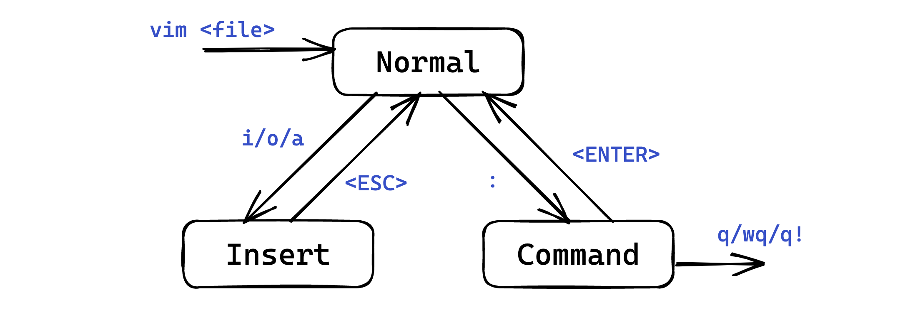
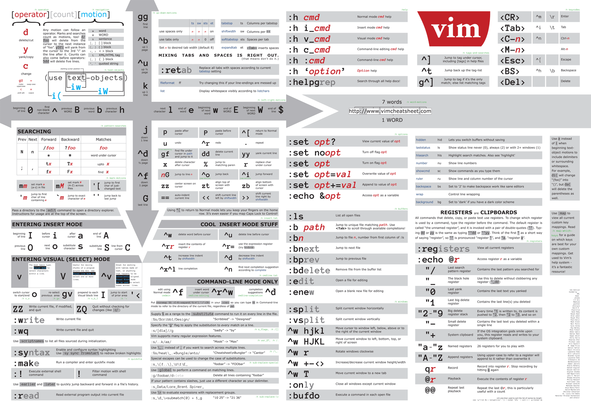

# Lec 2. Linux 及其工作流

<hr>

2025 年秋冬学期计算机学院朋辈辅学「技能拾遗」

<div class="avatar-container">
<a href="https://github.com/inuEbisu"></a>
<span class="avatar-name">@inuEbisu / 犬戎</span>
</div>

2025 年 10 月 31 日

---

## Part 1. 初识 Linux

-v-

### 主流的操作系统

- Microsoft Windows (1985.11.20)

- macOS (2001.3.24)

- Linux (1991.9.17)

> Linux：我会为你提供一切必要的工具。请你为自己所敲的每一行命令负责。
>
> macOS：我会尽可能地保护你。你可以不要我的保护；但若如此，请你为自己所敲的每一行命令负责。
>
> Windows：我是你妈

-v-

### 身边的 Linux

<div class="mul-cols">
<div class="col">

</img>

</div>
<div class="col">

智能手机：Android/Linux

电视机顶盒：Android/Linux

服务器：Linux

- 实验室中的服务器

- 日常生活中的互联网服务

</div>
</div>

-v-

### Linux 的历史渊源

- 1969 年，美国 AT&T 公司的贝尔实验室开发了 UNIX 操作系统

- 1983 年 9 月 27 日，Richard Stallman 在麻省理工学院发起了 GNU（GNU's Not Unix）计划
    - 目标是创建一套类似 UNIX 但完全自由的操作系统

    - 在 GNU 计划中诞生了 GNU 通用公共许可证（GPL）

- 1991 年，正在大学内进修的 Linus Torvalds 对 MINIX 不开心
    - 于是他编写了自己的 Linux 操作系统（Linux 内核）

- 开源社区及许多商业公司参与贡献，构建成完整的 Linux 操作系统

-v-

### Linux 的历史渊源

- GNU/Linux

- Android/Linux

-v-

### 为什么使用 Linux

- 事实标准

- 开源，自由，社区维护
    - [torvalds/linux](https://github.com/torvalds/linux)

    - [Android Open Source Project](https://source.android.com/)

- 轻量级
    - Alpine Linux 的 Docker 镜像大小为 7 MB

    - 配置要求低
        - 树莓派等单板计算机

        - 嵌入式：[在 Arduino Uno 上运行 Linux Kernel](https://hackaday.com/2023/10/13/because-you-can-linux-on-an-arduino-uno/)

-v-

### 为什么使用 Linux

- 稳定
    - [亲手造成的运维事故：在 Live CD 环境下部署并运行了 8 个月 - V2EX](https://v2ex.com/t/974678)

- 安全
    - 病毒较少

    - 权限管理严格

-v-

### 主流的 Linux 发行版

- Debian：历史悠久，自由，生态优良，稳定
    - Ubuntu：主打桌面应用，自由，时新且稳定，萌新梦开始的地方

- Arch Linux：「简单、现代、实在、人本、万能」，可高度自定义
    - 需要用户愿意通过了解操作系统而最大化地利用它

    - Manjaro：更注重易用，更适合一般用户

-v-

### 主流的 Linux 发行版

- Red Hat：历史悠久
    - Red Hat Enterprise Linux (RHEL)：收费、商业化，使用 GPL 开源

    - Fedora：功能完备，更新迅速，受 Red Hat 公司赞助成为 RHEL 上游

    - CentOS：RHEL 的源码编译而来，Community Enterprise Operating System

---

## Part 2. Shell 基础

-v-

### 人类的手癖

> 游戏里换弹癌狂按 `Tab`
>
> 篮球罚球时前运一下
>
> Windows 上 `F5`，Linux 上 `ls`
>
> `vim` 里 `i esc i esc` 代替思考，`jkjkjk` 代替写代码

-v-

### 为什么要使用命令行

- 命令行是一种操作计算机的方式，在开发过程中能较 GUI 做得更多更灵活

- 可以让你手在键盘上就能控制电脑，不需要鼠标

- 在没有显示器的机器上（例如通过 ssh 连接服务器时），只能使用命令行

使用命令行浏览网页：[fathyb/carbonyl](https://github.com/fathyb/carbonyl)

-v-

### Shell 与 Terminal

Shell

- 命令解释器：接收并解析命令，让操作系统执行，返回输出
- 用户与系统内核交互的接口

Terminal

- 终端模拟器，提供一个窗口（黑框框）

Terminal 从用户获取输入，然后传递给 Shell，等待 Shell 处理完后，将结果显示在屏幕上；

Shell 从 Terminal 拿到输入指令，解析后交给操作系统执行，然后将结果返回给 Terminal。

-v-

### Shell 与 Terminal

一些例子：

- 类 Unix 系统下，用户默认的 Shell 可以随意更换

- `Ctrl-C` 到底是复制还是中断程序？
    - 和 Shell 无关，是 Terminal 的行为

- 自己实现一个简单的 Shell：`shell.c`

-v-

### 主流的 Shell

`sh`：Bourne Shell

- 最早、最经典

`bash`：Bourne Again Shell

- 最常用，大部分 Linux 发行版的默认 Shell

`zsh`：Z Shell

- 功能强大、可高度自定义

`fish`：Friendly Interactive Shell

- 开箱即用、全平台

-v-

### Shell 界面

- Prompt: 命令提示符
    - 提供一些信息并等待输入
        - 工作路径、当前用户

        - ⚠️ `rm -rf ./*`

- 向其中输入命令，回车，即可执行命令

-v-

### 基本命令

- `pwd`：print working directory，打印当前命令

- `cd path`：change directory，切换路径
    - `~` 代表家目录，`.` 代表当前路径，`..` 代表上一级路径

- `ls`：list，列出当前路径下的文件和目录
    - `-a`：列出所有文件和目录，包括隐藏文件

    - `-l`：列出详细信息（文件权限，大小，修改时间等）

-v-

### 基本命令

- `touch file`：创建一个空文件

- `mkdir dir`：make directories，创建目录

- `cp src dst`：复制文件或目录

- `mv src dst`：移动（重命名）文件或目录

- `find path -name pattern`：在 `path` 下查找文件名匹配 `pattern` 的文件

-v-

### 基本命令

- `cat files...`：输出与拼接文件

- `head/tail file`：输出 `file` 前/后 10 行
    - `-n lines`：输出 `lines` 行

- `more/less file`：分页输出 `file` 内容
    - 空格翻页，回车下一行，`q` 退出

    - `less` 的功能更多，例如查找、更好的翻页等

- `hexdump file`：以十六进制输出文件内容
    - `-C`：并排输出十六进制与 ASCII

    - `-n N`：输出前 `N` 个字节

-v-

### 基本命令

- `man`：查看命令文档（manual）
- `echo`：输出字符串（常配合重定向 / 管道使用）
- `whoami`：获取当前用户
- `whereis/which/whence`：查找命令所在位置
- `clear`：清屏
- `chmod`：更改文件权限
- `ps`：显示进程信息
- `date`：获取当前日期时间
- `kill`：杀死进程（向进程发送信号）
- `grep`：搜索文件内容（常配合重定向 / 管道使用）
- `diff`：比较文件 / 目录内容
- `curl`：发送 HTTP 请求；`wget`：下载文件

自己查阅手册！

---

## Part 3. 文本编辑器

-v-

### Vim

Vi: 由 ex 发展而来的老牌文本编辑器

Vim: Vi IMproved，vi 的升级版，功能更强大

NeoVim: Vim 的一个 fork

-v-

### Vim 的特征

- 纯键盘操作，手不离主键盘区

- 强大的文本处理能力

- 每一台服务器上一定都有 Vim

- 学习曲线陡峭，学习成本高

现推荐 NeoVim

学习可输入命令 `vimtutor`；也有各种 Cheatsheet

> 学习 Vim 最好的方式是使用 Vim，熟能生巧

-v-

### Vim 中的模式

Vim 的设计哲学是多种模式

- Normal 模式：默认模式，用于移动光标、处理文本、执行命令等

- Insert 模式：用于输入文本

- Command 模式：用于执行命令

- Visual 模式：用于选择文本



-v-

### Vim Cheatsheet

From [vimcheatsheet.com](https://vimcheatsheet.com)



-v-

### 其他文本编辑器

Nano

- 与记事本操作相似，简单易上手

Emacs

- 同样纯键盘操作

- 功能强大，可拓展性极强

- 很多人从 Vim 转 Emacs，但很少有人从 Emacs 转 Vim

---

## Part 4. 项目组织

-v-

### 程序的编译过程

四步编译

1. 预处理：`gcc -E hello.c -o hello.i`
    - 处理 `#include` `#define` 等
    - 得到的 `hello.i` 是合法的 C 代码

2. 编译：`gcc -S hello.i -o hello.s`
    - 生成汇编代码

3. 汇编：`gcc -c hello.s -o hello.o`
    - 生成目标文件

4. 链接：`gcc hello.o -o hello`
    - 链接目标文件与库文件，生成可执行文件

-v-

### 多文件编程

程序远不止可在 PTA 等 OJ 上提交的单文件程序

- 还有多文件程序

- 大型项目……

接踵而至的问题：

- 编译命令太长了

- 编译太慢了

`src/lec2/multi`

-v-

### 使用 GNU Make 的原因

（当然也是使用任何 Autotools 的原因）

自动化

- 只需要写一个 Makefile，就可以通过一句命令来自动化地完成编译、测试、打包、部署等一系列操作
    - 即使是 Linux 内核，也可以通过一句 `make` 来完成编译

    - 不用每次都复制粘贴一大串的 `gcc ...` 了！

- 不仅仅用来编译 C/C++，任何命令都可以执行
    - 本课程的 Slides 即使用 `make` 简化输入命令

    - 比 Shell 脚本更容易编写

    - 处理依赖、读取命令行输入等 `make` 都会帮你完成

-v-

### 使用 GNU Make 的原因

增量编译

- 只重新编译项目中发生改变的部分，而不是每次都要重新编译整个项目
    - 显著变快

    - 原理是时间戳比较

-v-

### 基本语法

现在其实可以让 AI 写

```make
target: prerequisites...
    commands...
    commands...
```

- `target`: 目标文件 / 可执行文件 / 标签
    - `.PHONY` 定义伪目标
        ```make
        .PHONY: clean
        ```

- `prerequisites`: 依赖的 `target`

- `command`: 触发 `target` 时执行的 Shell 命令

-v-

### 使用例

`src/lec2/multi`

-v-

### 其他 Autotools

- CMake
    - 大型项目使用

    - 更上层，生成不同平台的构建文件（Makefile, Visual Studio 项目等）

    - 现代的语法

    - 依赖管理

- XMake
    - 更简单易用的新兴构建工具

    - 语法简洁，学习曲线平缓

    - 内置包管理功能

---

## Part 5. 参考资料

-v-

### 参考资料

Credit

- [Lec 1. Shell 基础及 CLI 工具推荐 —— 竺院朋辈辅学实用技能拾遗](https://slides.tonycrane.cc/PracticalSkillsTutorial/2023-fall-ckc/lec1/)

Linux 与操作系统基础

- [Linux 101](https://101.lug.ustc.edu.cn/)

- [命令行界面 (CLI)、终端 (Terminal)、Shell、TTY，傻傻分不清楚？- 知乎](https://zhuanlan.zhihu.com/p/516408816)

GNU Make

- [跟我一起写 Makefile](https://seisman.github.io/how-to-write-makefile/)

---

# 谢谢大家

<hr>

Questions?

<div class="avatar-container">
<a href="https://github.com/inuEbisu"></a>
<span class="avatar-name">@inuEbisu / 犬戎</span>
</div>

2025 年 10 月 31 日
