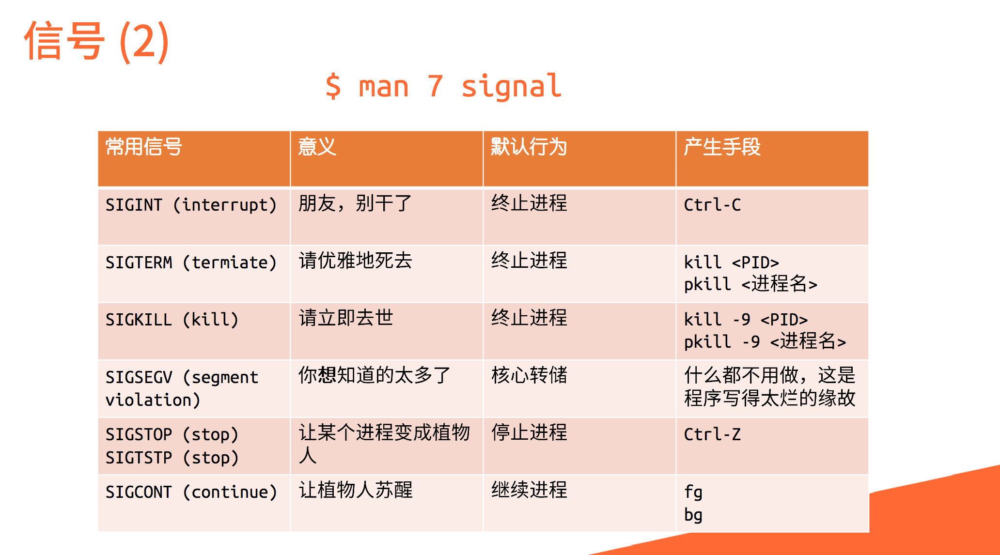

# Lec 3. Linux 系统知识基础

2025 年秋冬学期计算机学院朋辈辅学「技能拾遗」

@inuEbisu / 犬戎

2025 年 11 月 7 日

---

## Part 1. 进程

-v-

### 进程

进程是正在执行的程序的一个实例

当我们启动一个程序时

- 操作系统从硬盘中读取程序文件

- 将程序内容加载入内存中

- CPU 执行该程序

- 就看到了一个「进程」

查看：

- Windows：任务管理器

- Linux：`htop` 与 `ps`，相关命令还有 `pgrep`, `pkill` 等

-v-

### PID

Process Identifier，进程的唯一标识

操作系统启动后，从 1 开始分配 PID。

- 1: init，通常是 `systemd`

- 2: 内核守护进程 `kthreadd`

PID 通常是递增的

- `/proc/sys/kernel/pid_max`

-v-

### 信号

信号是 Unix 系列系统中进程之间相互通信的一种机制

- 发送信号：`kill`
    - 默认发送 `SIGTERM`

    - 早期信号的作用就是杀死进程

- `man 7 signal`

-v-

### 信号

（2018 年《Linux 101 ——进程、服务、任务》的演示文稿截图）

-v-

### 前后台切换

Shell 中有前后台的概念

- 在 shell 中直接运行命令，将挂到前台

- 在后台运行程序，可在命令最后加上 `&`

- 将前台程序切换到后台，可按下 Ctrl + Z 发送 `SIGTSTP` 使进程挂起

相关命令：`jobs` / `fg` / `bg`

-v-

### 脱离终端

终端一旦被关闭会向其中每个进程发送 `SIGHUP`

- SSH 时，你的 SSH 中运行的程序会停止

- 如果你要在你的服务器上挂一个 [ZJU-Live-better](https://github.com/5dbwat4/ZJU-Live-better)……

一些解决方案：

- 使用 `nohup` 命令执行脚本

- 使用 `systemd` 将脚本作为服务运行

- 使用终端复用器

-v-

### 终端复用器 tmux

命令行多终端方案

- 终端分屏

- 会话保持
    - 会话独立于终端存在

    - SSH 时不因断线而停止程序

-v-

### 终端复用器 tmux

tmux 由会话（session），窗口（window），面板（pane）组织起每个 shell 的输入框。

- 会话用于区分不同的工作

- 窗口是会话中以显示屏为单位的不同的页

- 面板是一个窗口上被白线分割的不同区域

该窗口不因断开连接或者暂时登出而消失，而是会保存在后台，下一次登录时可以立即还原。

-v-

### 终端复用器 tmux

前缀：`Ctrl + B`

| 默认快捷键 | 功能                               |
| :--------- | :--------------------------------- |
| `%`        | 左右分屏                           |
| `"`        | 上下分屏                           |
| `↑ ↓ ← →`  | 焦点切换为上、下、左、右侧 pane    |
| `d`        | 从 tmux 中脱离，回到命令行界面     |
| `z`        | 将 pane 暂时全屏，再按一次恢复原状 |
| `c`        | 新建窗口                           |
| `,`        | 为窗口命名                         |
| `s`        | 列出所有 session                   |

-v-

### 实践

`src/lec3/signal/loop.py`

- 查询到它的 PID，并尝试 `kill` 它

- 它按 `Ctrl + C` 不会退出，这是怎么做到的？
    - 尝试让它被 `kill` 也不会退出

    - 尝试让它被 `kill -9` 也不会退出

- 尝试让它在终端退出时不会退出
    - 可有多种方法

---

## Part 2. I/O

-v-

### 文件描述符

文件描述符是一个非负整数，代表已打开的 I/O 资源（文件、管道、socket、设备等）。

- 查看文件描述符表：`ls -la /proc/<PID>/fd/`

进程启动时自动打开三个标准文件描述符，即标准 I/O

- 0：标准输入 `STDIN_FILENO`

- 1：标准输出 `STDOUT_FILENO`

- 2：标准错误 `STDERR_FILENO`

-v-

### 重定向

改变标准输入输出的目的地

Shell 中的相关语法

| 语法               | 作用                     |
| :----------------- | :----------------------- |
| `cmd > file.txt`   | 标准输出重定向到文件     |
| `cmd 2> error.log` | 标准错误重定向到文件     |
| `cmd >> file.txt`  | 追加到文件               |
| `cmd < input.txt`  | 从文件读取标准输入       |
| `cmd 2>&1`         | 将标准错误合并到标准输出 |

C 中的 `freopen` 函数也有相同的功效

-v-

### 管道

管道是一个在内核内存中管理的、环形的、字节流式的缓冲区，用于进程间通信

通过 `pipe` 系统调用创建

在 Shell 中的语法是 `|`

- e.g. `ls | grep hello`

- 日常使用时，其实就是将前一个命令的输出作为后一个命令的输入

-v-

### 缓冲区

用户输入的字符被收集并储存在缓冲区（buffer）中

行缓冲，完全缓冲，不缓冲

- 行缓冲：出现换行符时刷新缓冲区，通常用于键盘输入

- 完全缓冲：仅缓冲区填满时刷新缓冲区（将内容发送至目的地）

Unix 约定 stdin 与 stdout 若与终端关联则为行缓冲，而 stderr 为无缓冲。

你可以手动刷新缓冲

-v-

### 实践

`src/lec3/io/stdio_eg.c`

- 使用 `strace` 查看进程的 `read` `write` 系统调用操作

- 使用 `ls -la /proc/$(pgrep stdio_eg)/fd` 观察文件描述符
    - `./stdio_eg`
    - `./stdio_eg < in.txt`
    - `./stdio_eg > out.txt`
    - `./stdio_eg 2> out.txt`
    - `./stdio_eg 2>&1`
    - `./stdio_eg | grep whatever`
    - 添加上 `freopen`
    - `printf "whatever" > /dev/pts/<?>`
    - ……

-v-

### 实践

[ZJUCTF2024: Silence](https://note.xecades.xyz/ctf/game/zjuctf2024#6)

- Xecades 学长出题

- 实现了一个 `shell`
    - 但标准输入、输出、错误流均被重定向到 `/dev/null`

- 一个非预期是将命令的输出重定向到 6 号文件描述符（`>&6`）即可将命令输出回显回终端
    - 具体原因比较复杂

`src/lec1/fork/fork.py`

- 在第一节课上提供的一个关于缓冲区的很神秘的例子，现在可以回头再看一看

---

## Part 3. 用户与权限

-v-

### 用户

现代操作系统都有「用户」的概念

服务器环境中：

- 为不同的使用者创建用户，分配不同的权限，保障系统的正常运行

- 为网络服务创建用户，通过权限限制，减小服务被攻击时对系统安全的破坏

对于个人用户：

- 区分使用者的用户与「系统用户」，并且划分权限
    - 尽可能避免或降低用户误操作带来的损失，保障系统完整

可以查看 `/etc/passwd` 文件得到系统中用户的配置信息

-v-

### 根用户

根用户（`root`）在 Linux 操作系统中拥有最高的权限，可以对系统做任何操作（包括删除所有系统文件这一类极端危险的操作）

在命令前加上 `sudo` 可以使我们以根用户的身份执行命令

> With great power comes great responsibility.

谨慎使用 root 用户权限执行命令！只在真的需要的时候使用。

以下是一些会对系统带来**毁灭性破坏**的例子。不要执行下面的命令！

- `rm -rf /`
    - 删除系统中的所有可以删除的文件，包括被挂载的其他分区

    - **即使不以 root 权限执行，也可以删掉自己的所有文件**

-v-

### 根用户

以下是一些会对系统带来**毁灭性破坏**的例子。不要执行下面的命令！

- `mkfs.ext4 /dev/sda`
    - 将系统的第一块硬盘直接格式化为 ext4 文件系统，破坏其上所有的文件

- `dd if=/dev/urandom of=/dev/sda`
    - 对系统的第一块硬盘写入伪随机数，破坏其上所有的文件，并且降低找回文件的可能性

- `:(){ :|: & };:`
    - 称为「Fork 炸弹」，会消耗系统所有的资源
    - 在未对进程资源作限制的情况下，只能通过重启系统解决，所有未保存的数据会丢失

-v-

### 文件权限

在 Linux 中，每个文件和目录都有自己的权限

使用 `ls -l` 查看文件详细信息

- 文件类型（一位）

- 文件所属用户的权限（三位）

- 文件所属用户组的权限（三位）

- 其他人的权限（三位）

- 第一位 `r` 代表读取 (Read)，第二位 `w` 代表写入 (Write)，第三位 `x` 代表执行 (Execute)，`-` 代表没有对应的权限

可使用 `chmod` `chown` 等命令修改权限

-v-

### Linux 下的文件架构

类 Unix 系统中，整个系统的文件都从根目录 `/` 开始，形成目录树结构

- 没有「C 盘」「D 盘」等分区盘符
    - 其他的分区以挂载 (mount) 的形式「挂」在树上

[文件系统层次结构标准 (FHS, Filesystem Hierarchy Standard)](https://refspecs.linuxfoundation.org/FHS_3.0/fhs/index.html) 定义了 Linux 发行版的标准目录结构

[文件系统层次结构 - Linux 101](https://101.lug.ustc.edu.cn/Ch05/#fhs)

---

## Part 4. Debug

-v-

### 为什么需要 debug

> A golden rule in programming is that code does not do what you expect it to do, but what you tell it to do. Bridging that gap can sometimes be a quite difficult feat.

程设课使用纸质试卷进行考试

- 这要求大家在不运行的情况下一次写对代码，并使用肉眼瞪出看似合理的代码的问题
- 这对于稍大一些的程序不再可能

> 2014 年图灵奖得主 [Michael Stonebraker](https://en.wikipedia.org/wiki/Michael_Stonebraker) 在一次访谈中提到，他当时花了 5 年时间开发了世界上第一个关系数据库系统 Ingres，其中 90% 的时间用于将它运行起来。也就是说，在开发过程中，有 90% 的时间系统都是运行不起来的，是有 bug 的，需要调试。

-v-

### `printf` 大法

`printf` 大法输出中间变量

- `printf` 函数会打印到标准输出
    - 如果忘记删除会影响 OJ 判题

    - 可以使用 `fprintf(stderr, "whatever");`

-v-

### GNU Debugger

在编译时要加上 `-g` 选项，生成的可执行文件才能用 `gdb` 进行源码级调试

- `gcc hello.c -o hello -Wall O3 -g`

- 还需要保证 `gdb` 能找到源文件

-v-

### GNU Debugger

| 命令             | 描述                                       |
| :--------------- | :----------------------------------------- |
| `r(un)`          | 运行程序，在断点处停止运行                 |
| `start`          | 运行程序，在 main 时停止运行               |
| `c(ontinue)`     | 继续执行，到下一个断点处                   |
| `n(ext)`         | 单步调试，不进入函数体                     |
| `s(tep)`         | 单步调试，如果遇到函数则进入函数体         |
| `b(reakpoint) n` | 在第 n 行设置断点                          |
| `display expr`   | 每次单步进行指令后，输出被设置的表达式及值 |
| `watch expr`     | 设置监视点，表达式值改变时终止程序         |
| `q`              | 退出 gdb                                   |

工具熟能生巧，更多命令等待你探索

-v-

### GNU Debugger

`src/lec3/debug/add_range.c`

---

## Part 5. 参考资料

-v-

### 参考资料

进程

- [进程、前后台、服务与例行性任务 - Linux 101](https://101.lug.ustc.edu.cn/Ch04/)
    - 大量内容参考至此

- [Command-line Environment - MIT The Missing Semester](https://missing.csail.mit.edu/2020/command-line/)
    - `loop.py` 的例子来自这里

I/O 与文件

- [讲义：I/O 与文件 -（23 秋冬）程设辅学课程 系统知识拾遗](https://ckc-agc.bowling233.top/programming/archive/23fall/lec3/lec3/)

-v-

### 参考资料

Debug

- [Debugging and Profiling - MIT The Missing Semester](https://missing.csail.mit.edu/2020/debugging-profiling/)

- [讲义：程序编译过程与调试技术 -（23 秋冬）程设辅学课程 系统知识拾遗](https://ckc-agc.bowling233.top/programming/archive/23fall/lec1/lec1/)

- [第 10 章 gdb - Linux C 一站式学习](https://www.kancloud.cn/wizardforcel/linux-c-book/134935)

---

# 谢谢大家

Questions?

@inuEbisu / 犬戎

2025 年 11 月 7 日
