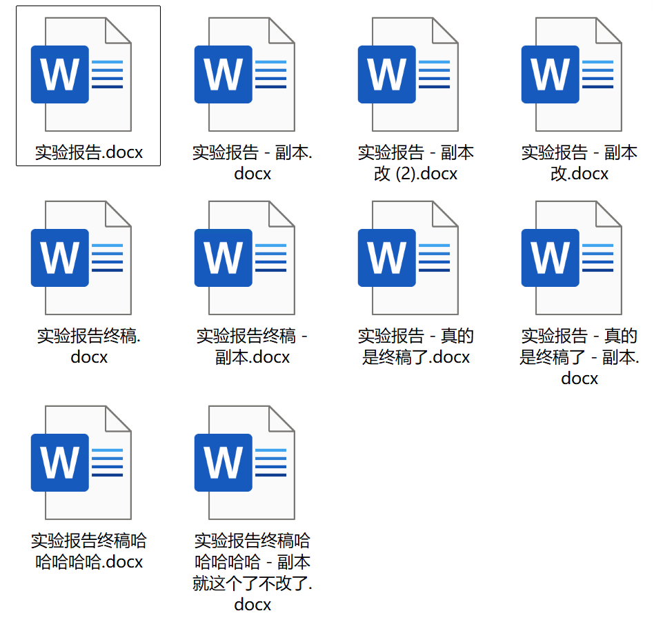
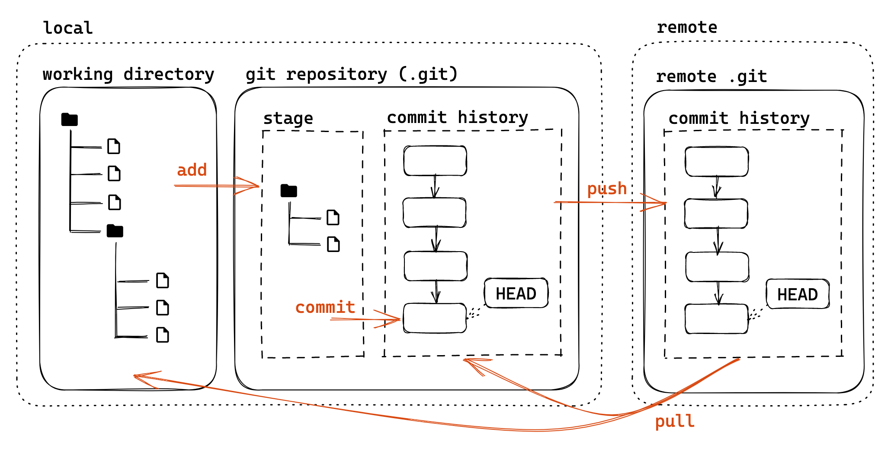
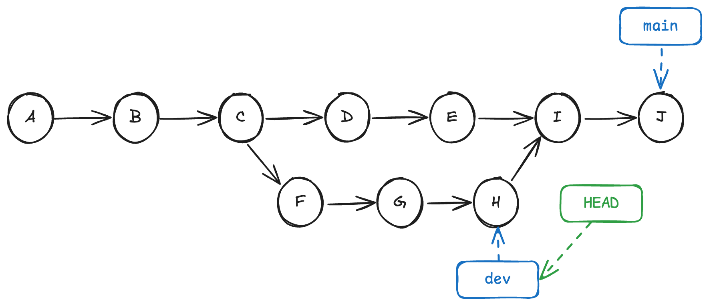
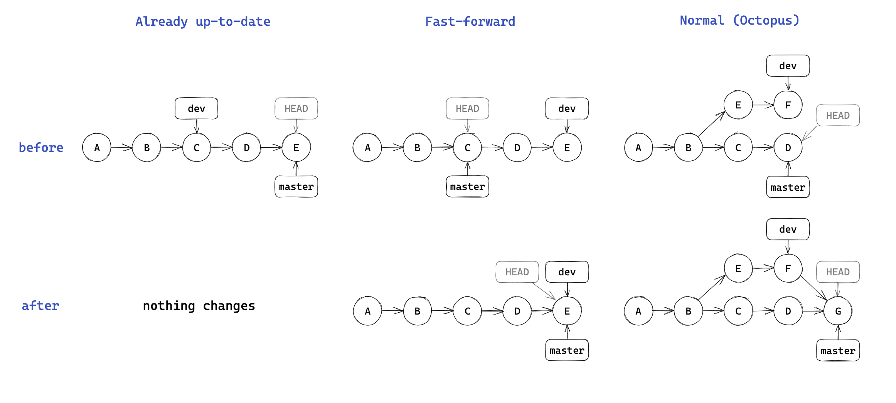
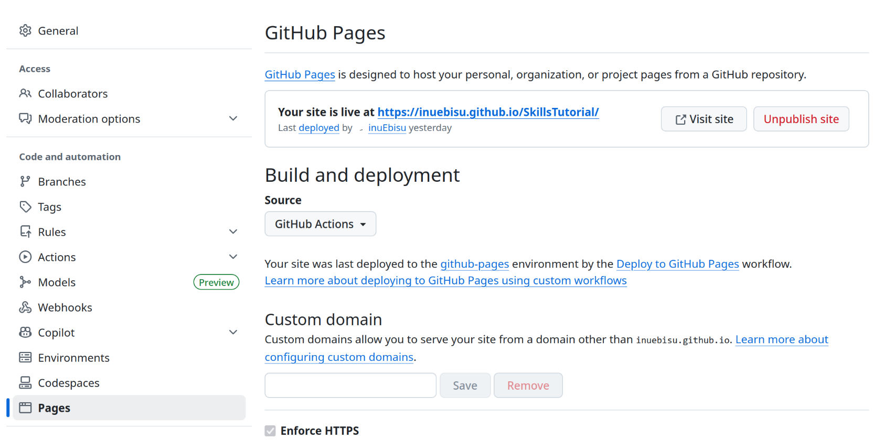
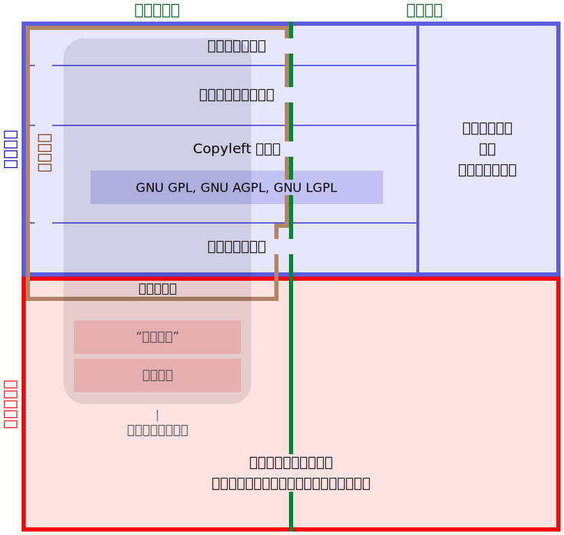
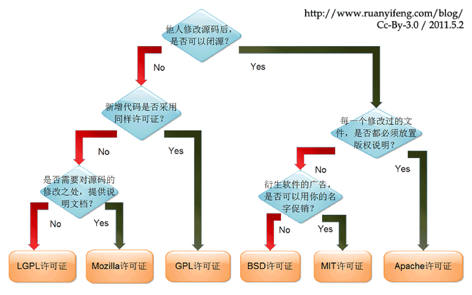
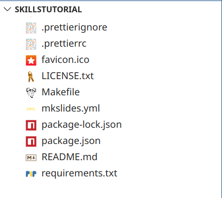

# Git，GitHub 与开源

<hr>

2025 年秋冬学期计算机学院朋辈辅学「技能拾遗」

<div class="avatar-container">
<a href="https://github.com/inuEbisu"></a>
<span class="avatar-name">@inuEbisu / 犬戎</span>
</div>

2025 年 11 月 28 日

---

## Part 1. Git

-v-

### Git Introduction

版本控制系统（Version Control Systems，VCS）

- 记录文件的自创建以来的每一个版本，在不同版本之间自由切换

<div class="mul-cols">
<div class="col">



</div>
<div>

安装

- 类 Unix：包管理器安装

- Windows: [git-scm.com](https://git-scm.com/downloads/win)，下载 64 位版本安装

</div>
</div>

-v-

### Git 基础配置

- 创建一个本地 git 版本库
    - `git init`

- git 账号配置
    - 多人合作区分用户 / 让 GitHub 能够识别出你
    - `git config --global user.name "name"`
    - `git config --global user.email "email"`
        - 针对某一仓库专门设置：不加 `--global`

- 建议配置 commit 签名
    - 使用 GPG 生成密钥对

    - 原因后面会提及

-v-

### Git 基本模型

</img>

图源：[2023 秋冬实用技能拾遗 - TonyCrane](https://slides.tonycrane.cc/PracticalSkillsTutorial/2023-fall-ckc/lec2/#/1/3)

-v-

### Commit

快照（Snapshot，又称 Commit、提交）

- 每一个快照都由一个十六进制数唯一标识
    - 这个十六进制数其实是该提交的 SHA-1

    - 之后的提交会包括之前提交的 SHA-1，从而形成链式结构

    - ~~Git 也是区块链~~

-v-

### Commit

`git commit`



图源：[（24 秋冬）程设辅学](https://ckc-agc.bowling233.top/programming/24fall/lec3/#git_2)

-v-

### Commit Message

记录更改的原因与内容，方便定位与回溯

- 无论是自用还是合作都很重要

- 如今可以使用大模型帮忙撰写

可选用的规范：[约定式提交](https://www.conventionalcommits.org/zh-hans/v1.0.0/)

- 其还可与 [语义化版本](http://semver.org/lang/zh-CN) 对应

```txt
docs: add initial content for Lec 1
fix: update project name and description in README.md
```

-v-

### Branch

- `git branch`
- `git checkout (-b)`

创建 commit 的引用：`master` / `main` / `HEAD`


-v-

### Merge

- `git merge`



图源：[2023 秋冬实用技能拾遗 - TonyCrane](https://slides.tonycrane.cc/PracticalSkillsTutorial/2023-fall-ckc/lec2/)

-v-

### .gitignore

让 Git 忽略掉你的文件

```.gitignore
__pycache__
node_modules
.DS_Store
```

- `#` 开头的行是注释。
- `*` 代表通配符，匹配多个字符。例如 `*.c` 匹配所有 `.c` 结尾的文件。
- `**` 通配多个目录。例如 `a/**/b` 匹配 `a/b`、`a/x/b`、`a/x/y/b` 等。
- `/` 开头只匹配根目录，否则匹配任意目录。
- `!` 开头是取消忽略。

网络上有很多针对特定语言项目的模板

-v-

### 奇技淫巧

例如

- 各式各样的奇怪 `rebase`
    - 例如 `cherrypick` 挑一些 commit 进行 rebase

- `git bisect` 二分查 bug

需要奇技淫巧时可以询问大模型

-v-

### 在 VSCode 中使用 Git

<div class="mul-cols">
<div class="col">

[Visual Studio Code](https://code.visualstudio.com/) 中有 Git GUI

- 小白也可以方便地使用 Git

试一试

</div>
<div>


</div>
</div>

---

## Part 2. GitHub

-v-

### 远程版本库

</img>

图源：[2023 秋冬实用技能拾遗 - TonyCrane](https://slides.tonycrane.cc/PracticalSkillsTutorial/2023-fall-ckc/lec2/#/1/3)

-v-

### 远程版本库

GitHub / ZJU Git 最主要的功能是远程版本库

- Git 这样的分布式 VCS 实现中心化协作的关键

- 远程版本库通常是一个裸的 `--bare`

- `git clone` / `git push` / `git pull`

- 当成一个无限大网盘使用也可行

除此之外 GitHub 也有更强大的功能

- Fork, Pull Request

- 社交功能：Follow, Trend, Star... 可以逛，可以刷

- GitHub 目前需要魔法上网

-v-

### GitHub 基础使用

Settings > Access > Emails 设置为 git 配置的邮箱

- GitHub 参照版本库中提交者的邮箱将提交者关联至其 GitHub 账号

- 所以还建议配置 GPG 密钥对 commit 进行签名
    - [delete linux because it sucks](https://github.com/torvalds/linux/tree/8bcab0346d4fcf21b97046eb44db8cf37ddd6da0)

    - 参考 [Signing commits - GitHub Docs](https://docs.github.com/en/authentication/managing-commit-signature-verification/signing-commits)

什么是签名？

- 数学上存在 $(D, E, K_{1}, K_{2})$，满足 $D(K_{2},\ E(K_{1},\ m)) = m$

- 发送者 $c = E(K_{1},\ m)$，接收者 $m = D(K_{2},\ c)$。

- 非对称加密即只有接收者有 $K_2$，数字签名即只有发送者有 $K_1$

-v-

### GitHub 仓库使用

- 新建 repo，基本设置

- 添加代码：
    - 从头开始的空项目：直接 clone
    - 从本地非 git 项目上传：init 后修改 remote
    - 修改、add、commit、push

- 分支、合并：branch / GitHub 上操作

- Release：扩展的打 tag

- 小组项目合作：协作者、私有 Repo 权限管理
    - Pull Request、Merge、conflict 处理

-v-

### GitHub 协作与贡献

主要是 Pull Request

<div class="mul-cols">
<div class="col">

完整的操作：

- Fork

- `git clone`

- `git commit`

- `git push`

- Pull Request

</div>
<div class="col">

</div>
</div>

-v-

### GitHub Pages

GitHub 提供的静态网页托管

本课程的 Slides、犬戎的博客与笔记均部署在 GitHub Pages



-v-

### GitHub Actions

GitHub 提供的 CI/CD 服务

- CI（Continuous Integration，持续集成）

- CD（Continuous Delivery，持续交付）

即配置一些自动化任务，在特定事件发生时自动执行

- 例如每次 push 后自动测试，release 时自动构建部署

- 有人用其挂原神签到……（违反了 ToS，可能被封号）

配置文件：`.github/workflows/workflow_name.yml`

[GitHub 文档](https://docs.github.com/en/actions) / [GitHub Actions 入门教程](https://www.ruanyifeng.com/blog/2019/09/getting-started-with-github-actions.html)

-v-

### 实践

1. 为仓库 [inuEbisu/SkillsTutorial](https://github.com/inuEbisu/SkillsTutorial) 点一个 Star

2. 尝试在课程 Project 中使用 Git 与远程版本库进行协作
    - 不要再压缩包传来传去了 😭

3. 尝试使用 GitHub Pages 构建自己的个人主页
    - 如果使用 Hexo 等框架，还可使用 GitHub Actions 进行自动化部署

---

## Part 3. 开源社区

-v-

### FSF 的诞生

- 1980 年，Richard Matthew Stallman（RMS）在 MIT 的人工智能实验室工作
    - 实验室有一台施乐（Xerox）打印机，经常卡纸；RMS 想添加「卡纸通知」功能，然而驱动是闭源的

- 1983 年，RMS 宣布发起 GNU 计划（GNU's Not Unix），旨在创建一个完全自由的操作系统

- 1985 年，RMS 成立了 FSF（Free Software Foundation，自由软件基金会）

<div class="mul-cols">
<div class="col">
<ul>

- Free Software（自由软件）概念

- Copyleft 概念与 GPL

</ul>
</div>
<div>

</div>
</div>

-v-

### 四大自由

> Free as in Speech, not Free as in Beer
>
> <div style="text-align: right;">—— <a href="https://www.gnu.org/philosophy/free-sw.zh-cn.html">什么是自由软件？- GNU 工程</a></p>

四大自由（The 4 Freedoms）

- Freedom 0: 自由运行 The freedom to run the program as you wish, for any purpose.
- Freedom 1: 自由修改 The freedom to study how the program works, and change it so it does your computing as you wish.
- Freedom 2: 自由分发拷贝 The freedom to redistribute copies so you can help your neighbor.
- Freedom 3: 自由分发修改 The freedom to distribute copies of your modified versions to others.

-v-

### Copyleft

- Copyright: 保留所有权利。

- Copyleft: 任何分发修改后版本或衍生作品的人，必须以相同的自由条款分发其作品。
    - 递归性
    - 有人认为这是「病毒」，有「传染性」

- Copyleft 的实现：GPL（General Public License）

<div align="right"></div>

-v-

### GNU/Linux 的诞生

GNU 计划写好了编辑器（Emacs）、编译器（GCC）、Shell（Bash），唯独缺一个内核（Hurd 开发受阻）

- 1991 年，Linus Torvalds 发布了 Linux 内核
    - Linus 是一个实用主义者

    - 他出于实用主义的考量选择了 GPLv2

    - 后话：2007 年时 GPL 更新至 v3，但 Linus 拒绝更新

- GNU + Linux 构成了一个完整的 GNU/Linux 操作系统，大获成功

-v-

### 很多人不喜欢 FSF

FSF 是一个意识形态意味很重的组织，FSM 是一个政治运动

- 其认为编写专有软件是不道德、反社会的

- 措辞上：
    - 拒绝「知识产权」「盗版」等词

    - 把 Digital Rights Management 叫作 Digital Restrictions Management

    - 坚持将常说的 Linux 操作系统叫作 GNU/Linux

- 拒绝任何非自由软件
    - RMS 拒绝使用智能手机，使用 LibreJS 拒绝访问含非自由 JavaScript 代码的网页

-v-

### FSF 与 OSI 的爱恨情仇

- 1997 年，Eric S. Raymond (ESR) 发表了文章《大教堂与集市》
    - 他认为 Linux 成功不是因为道德高尚，而是因为「集市」式「早发布，常发布」开发模式的效率
    - 引起了商业界的轰动

- 1998 年，Netscape 公司想要开放 Netscape 浏览器的源码

- 1998 年 2 月，ESR 等人在硅谷开会（帕洛阿尔托会议）
    - 他们想要给这种开发模式改个名字，剥离 RMS 的政治和道德色彩

    - 最终选定了 Open Source（开源）这个词

- OSI (Open Source Initiative) 成立，分裂形成

-v-

### 开源与自由



-v-

### 选择软件开源许可证

[choosealicense.com](https://choosealicense.com/licenses/)

- Copyleft 许可证
    - GPL（GNU General Public License）
        - GPLv2/v3, AGPL, LGPL

    - Mozillia Public License: 文件级别的 Copyleft

- 宽松许可证
    - MIT License：仅要求署名；BSD 类似

    - Apache：包括了专利中止和侵害保护条款
    - Unlicense, WTFPL：放弃权利，进入公共领域

- No License: 原作者保留所有权利，不允许复制、分发、修改

-v-

### 选择软件开源许可证

流行的软件开源许可证



-v-

### 非软件开源许可证

> 本作品采用知识共享署名-非商业性使用-禁止演绎 4.0 国际许可协议进行许可。

CC（[Creative Commons](https://creativecommons.org/share-your-work/cclicenses/)）系列许可证，用于知识共享

- CC 0：放弃所有权，进入公共领域。

- CC BY：BY 表示必须署名。

- CC BY-SA：SA 表示必须使用相同许可证（Share-Alike）。

- CC BY-NC：NC 表示禁止商业用途（Non-Commercial）。

- CC BY-ND：ND 表示禁止演绎（No-Derivatives）。

- CC BY-NC-SA, CC BY-NC-ND; 显然带有 NC/ND 的不是自由协议

-v-

### 非软件开源许可证

SIL Open Font License，用于字体，自由且 Copyleft

- 例如 TonyCrane 学长喜欢的[霞鹜文楷](https://github.com/lxgw/LxgwWenKai)

-v-

### 使用开源许可证

- 仓库根目录下包含文件 `LICENSE`，其中附上许可证内容
    - 也可叫 `LICENSE.txt`

- GitHub 可以从模板生成一些 `LICENSE`，也会根据内容识别并显示许可证

<div class="mul-cols">
<div class="col">

- 采取多个许可证：都要放，并说明许可证作用范围

</div>
<div>

</div>
</div>

-v-

### 开源社区

开源社区有着独一无二的开放协作氛围

入手或许可以考虑 GSoC / OSPP

- [Google Summer of Code](https://summerofcode.withgoogle.com/)

- [开源软件供应链点亮计划 - 开源之夏](https://summer-ospp.ac.cn/)


-v-

### 实践

1. 思考题：

    【真实案例】浙江大学计算机学院的陈某曾新建一个仓库，分发仓库 [Mythologyli/iOSFakeRun](https://github.com/Mythologyli/iOSFakeRun) 的二进制文件。他的仓库中没有提供源代码，同时没有提及原作者。他的行为有什么问题？

    （提示：iOSFakeRun 使用 LGPL-2.1 开源。）

---

## Part 4. 参考资料

-v-

### 参考资料

竺院辅学

- [Lec 2. Git / GitHub 及开源基础](https://slides.tonycrane.cc/PracticalSkillsTutorial/2023-fall-ckc/lec2/#/)

- [第三讲：开源世界生存基础](https://ckc-agc.bowling233.top/programming/24fall/lec3/)

Git

- [Explain Git with D3](https://onlywei.github.io/explain-git-with-d3/)

开源社区

- [各类许可证及其评论 - GNU 工程](https://www.gnu.org/licenses/license-list.html)

---

# 谢谢大家

<hr>

Questions?

<div class="avatar-container">
<a href="https://github.com/inuEbisu"></a>
<span class="avatar-name">@inuEbisu / 犬戎</span>
</div>

2025 年 11 月 28 日
