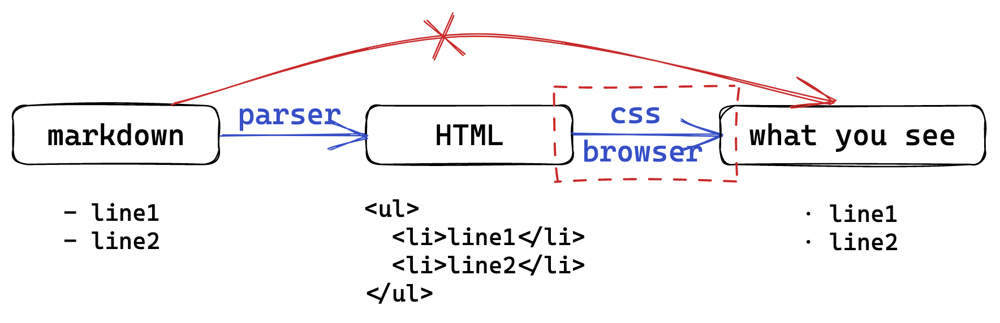
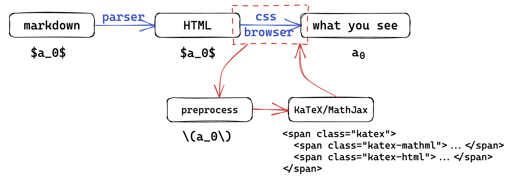
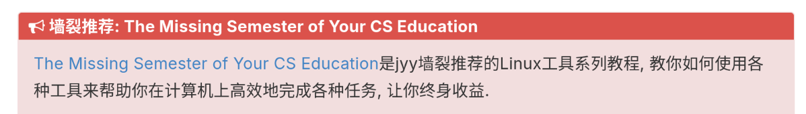

# 技术写作、科学写作与排版

<hr>

2025 年秋冬学期计算机学院朋辈辅学「技能拾遗」

<div class="avatar-container">
<a href="https://github.com/inuEbisu"></a>
<span class="avatar-name">@inuEbisu / 犬戎</span>
</div>

2025 年 12 月 5 日

---

## Part 1. Markdown

-v-

### Markdown 是什么

- 轻量级标记语言 (Lightweight Markup Language)
    - 到 HTML 的单射

- 核心理念：WYSIWYM (What You See Is What You Mean)
    - 与 WYSIWYG (What You See Is What You Get) 相对

    - 关注内容结构（标题、列表、代码），而非视觉样式

    - 样式渲染交给工具（浏览器、Pandoc）

<a href="https://slides.tonycrane.cc/PracticalSkillsTutorial/2023-fall-ckc/lec3/#/1/3"></a>

-v-

### 为什么学习 Markdown

为什么它是 CSer 的必备技能

- 事实标准，不得不学
    - README, Issue, PR, Wiki, Blog...
    - 甚至 ChatGPT 的输出也是 Markdown

- 纯文本，Git 友好

-v-

### 常见的 Markdown 编辑器

个人常用：

- VS Code + Markdown All in One

- Obsidian

- ~~CC98~~

个人不喜欢 Typora

- 选择 Markdown 就是为了摆脱「所见即所得」

- 闭源付费……

-v-

### Markdown 基础语法

这里简单演示一遍，需要查表细节可自行搜索

<div class="mul-cols">
<div class="col">

基础语法（基于 [CommonMark](https://commonmark.org/)）

- 标题 `#`，段落 `换行`

- 列表 `-` / `1.`

- 加粗 `**`，强调 `*`

- 代码 `` ` ``，引用 `>`

- 链接 `[]()`，图片 ``

- HTML 嵌入

</div>
<div class="col">

部分扩展语法

- 表格 `| (:)---(:) |`
    - 哪边有引号是哪边对齐，两边都有就是居中

- 任务列表 `- [ ]` / `- [x]`

- 脚注 `[^1]`

</div>
</div>

-v-

### Markdown 数学公式

行内公式：`$ $`

公式块：`$$ $$`

- Markdown 解析器只负责识别 `$` 符号

- HTML 保留公式文本，交给 MathJax 或 KaTeX 等 JS 库来处理
    - 借用了 LaTeX 的数学公式语法，不是真正的 LaTeX

<a href="https://slides.tonycrane.cc/PracticalSkillsTutorial/2023-fall-ckc/lec3/#/3/4"></img></a>

-v-

### 支持 Markdown 的实用工具

[MkDocs](https://www.mkdocs.org/)

- 浙江大学部分课程的实验文档、不少学长的笔记使用 MkDocs 搭建

- 我的 [猎人笔记](https://note.inuebisu.cn)
- 推荐主题：[mkdocs-material](https://squidfunk.github.io/mkdocs-material/)

[MkSlides](https://github.com/MartenBE/mkslides)

- 本课程 Slides 使用 MkSlides 搭建

- 欢迎使用我的模板：[inuEbisu/SlideTemplate](https://github.com/inuEbisu/SlideTemplate)

-v-

### 支持 Markdown 的实用工具

想要搭建个人博客？

- [Hexo](https://hexo.io/zh-cn/)

- [Astro](https://astro.build/)

- 等等……

---

## Part 2. LaTeX

-v-

### LaTeX 是什么

$\LaTeX$

- 基于 $\TeX$ 的排版系统

- 学术界、出版界的标准

- 「内容与格式分离」的极致体现
    - 你负责写内容，LaTeX (和模板) 负责排版

-v-

### 使用 LaTeX

- Online: [Overleaf](https://www.overleaf.com/)
    - 无需配置环境，打开浏览器即用

    - 丰富的模板库

- Local: TeX Live + VSCode (LaTeX Workshop)
    - 编译速度快，隐私性好

    - 可配合 Copilot 写作

-v-

### LaTeX 文档结构

```latex
\documentclass{article} % 文档类
\usepackage{graphicx} % 导言区 (Preamble): 引入宏包，设置样式

\title{Test project for \LaTeX}
\author{Ebisu Moto}
\date{December 2025}

\begin{document} % 正文区

\maketitle

\section{Introduction}

This is an introduction for overleaf.

\section{Math Formula}

$$
\sum_{i=1}^{n}i = \frac{n(n+1)}{2}.
$$

\end{document}
```

-v-

### LaTeX 数学公式

- 行内公式 `$ E = mc^2 $` -> $ E = mc^2 $
- 行间公式 `$$ \sum_{i=1}^n i = \frac{n(n+1)}{2} $$`

$$ \sum\_{i=1}^n i = \frac{n(n+1)}{2} $$

- 常用符号：
    - 上下标 `^_` 求和 `\sum` 求积 `\prod` 分数 `\frac{a}{b}`

    - 希腊字母 `\alpha` `\Alpha` `\beta` `\lambda` 偏导 `\partial`

[Detexify](https://detexify.kirelabs.org/classify.html) / ATFAI / STFW / 手写后丢给 Gemini 等多模态大模型

-v-

### LaTeX 数学公式中的字体

| 样式         | LaTeX 代码   | 效果                                    | 备注                         |
| ------------ | ------------ | --------------------------------------- | ---------------------------- |
| 粗体         | `\mathbf{}`  | $\mathbf{a}, \mathbf{A}$                | 向量、矩阵                   |
| 直立罗马字体 | `\mathrm{}`  | $\mathrm{e}, \mathrm{sin}, \mathrm{d}x$ | 特定常数、特定函数、微分算子 |
| 无衬线字体   | `\mathsf{}`  | $\mathsf{A}$                            | 张量                         |
| 空心字体     | `\mathbb{}`  | $\mathbb{Z^+}$                          | 特定数集                     |
| 手写体       | `\mathcal{}` | $\mathcal{E}$                           | 电动势                       |
| 整体斜体     | `\mathit{}`  | $\mathit{dim}$                          | 多字母变量                   |

---

## Part 3. Typst

-v-

### Typst 是什么

> 排版原神，启动！

- 新一代基于标记语言的排版系统

- 目标：像 Markdown 一样易写，像 LaTeX 一样强大

- 特点：
    - 快：Rust 编写，增量编译，实时预览
    - 易：语法更现代，报错更友好
    - 强：它有脚本模式，有函数，有变量，有类型，是一门图灵完备的编程语言

- 生态正在逐渐完善
    - 开始有大模型（例如 Gemini 3 Pro）会写 Typst 了

-v-

### LaTeX VS Typst

| 特性     | LaTeX                               | Typst                    |
| :------- | :---------------------------------- | :----------------------- |
| 历史     | 40+ 年，历史包袱重                  | 新兴，轻量               |
| 编译速度 | 慢，甚至多次编译                    | Rust 编写，极快，实时    |
| 语法     | 反斜杠与大括号齐飞<br>`\frac{1}{2}` | 简洁<br>`1/2`            |
| 环境配置 | 几个 G                              | 一个二进制文件 / Web App |

都说用了就回不去了

-v-

### 怎么用 Typst

- Online: [typst.app](https://typst.app/)
    - 类似 Overleaf，体验极佳

- Local: VSCode + Tinymist 插件
    - 官方推荐的开源插件

    - 实时预览

    - LSP 支持

-v-

### Typst 一瞥

```typst
= 标题

这是段落。*着重* 和 _强调_。

- 列表项 1
- 列表项 2

== 数学公式

数学公式非常优雅：

$ E = m c^2 $
$ a / b $
```

`src/lec5/typst_grammar.typ`

-v-

### Typst 教程

Typst 有三种模式

- 标记模式

- 脚本模式

- 数学模式

推荐教程

- [The Raindrop-Blue Book (Typst中文教程)](https://typst-doc-cn.github.io/tutorial/)

顺便推销我的模板：

- 欢迎使用 [inuEbisu/bubble-zju](https://github.com/inuEbisu/bubble-zju)

- 欢迎使用 [inuEbisu/zjuphylab](https://github.com/inuEbisu/zjuphylab) 撰写大学物理实验报告

-v-

### Typst 数学公式

基本语法

- 行内公式 `$x$`，行间公式 `$ x $` (首尾加空格)

- 分数 `x/y`，根号 `sqrt(x)`

- 符号 `alpha` / `Alpha` / `sum` / `product` / `integral` / `sin`
    - [General Symbols - Typst Documentation](https://typst.app/docs/reference/symbols/sym/)

- 反斜杠和大括号消失了

-v-

### Typst 数学公式

| 字体样式   | Typst 代码   | 效果          |
| :--------- | :----------- | :------------ |
| 粗体       | `bold(a)`    | $\mathbf{a}$  |
| 直立       | `upright(a)` | $\mathrm{a}$  |
| 无衬线字体 | `sans(A)`    | $\mathsf{A}$  |
| 空心字体   | `ZZ`         | $\mathbb{Z}$  |
| 手写体     | `cal(E)`     | $\mathcal{E}$ |

---

## Part 4. 技术文档写作与排版

-v-

### 中文文案排版

中西文之间到底要不要加空格？

- 中英文之间要加空格

- 中文与数字之间要加空格

- 数字与单位之间要加空格
    - 例外：数字与度数符号、百分比符号之间不加空格

- 全角标点与其他字符之间不加空格

> 新款 14 寸 MacBook Pro 有 15% 的 CPU 性能提升，支持 180° 翻折，SSD 最高可选配 1 TB，售价 15999 元。刚入手了一部 MacBook Pro，好开心！

-v-

### 中文文案排版

使用全角中文标点；遇到完整的英文整句、特殊名词，其内容使用半角标点。

> Von Neumann 曾说：「Young man, in mathematics you don't understand things. You just get used to them.」

描述英文书名时使用斜体，不借用中文书名号。

> 推荐阅读《算法导论》与 _Algorithm Illuminated_。

-v-

### 语言风格

参考 [中文技术文档写作风格指南](https://zh-style-guide.readthedocs.io/zh-cn/latest/index.html) 与 [中文文案排版指北](https://github.com/sparanoid/chinese-copywriting-guidelines/blob/master/README.zh-Hans.md)。

语言风格

- 平易近人，直截了当，可使用对话式

- 简洁清晰，通俗易懂

- 用户导向，客观礼貌

- 用词恰当

-v-

### 通俗易懂

技术文档中不推荐使用只有特定人群才了解的语词：

- 不推荐使用行话黑话、俚语、脏话等，例如「魔改」（即做特殊的优化）、「CPU 打到 60%」（即 CPU 使用率为 60%）等黑话；

- 不推荐使用网络流行语，例如「墙裂」「童鞋们」等流行语中故意的谐音错别字。

- 专有名词使用正确的大小写，不使用不地道的缩写。

-v-

### 例子

> 在《技能拾遗》这门课程中，我们教授了 GitHub，还教授了 LaTeX。

> 我们需要一位熟悉 TypeScript、HTML5，至少理解一种框架（如 React、Next.js）的前端开发者。

而不是：

> Github，latex

> 我们需要一位熟悉 Ts、h5，至少理解一种框架（如 RJS、nextjs）的 FED。

-v-

### 例子

[南京大学《计算机系统基础》课程实验文档](https://nju-projectn.github.io/ics-pa-gitbook/ics2024/index.html)



---

## Part 5. 参考资料

-v-

### 参考资料

前面仅介绍到足够日常使用，如有进一步需求，You know what to do!

竺可桢学院朋辈辅学《实用技能拾遗》课程

- [Lec 3. Markdown 语法及应用](https://slides.tonycrane.cc/PracticalSkillsTutorial/2023-fall-ckc/lec3/#/)

- [Lec 4. LaTeX 排版简要介绍](https://slides.tonycrane.cc/PracticalSkillsTutorial/2023-fall-ckc/lec4/lec4.pdf)

Markdown

- [CommonMark](https://commonmark.org/)

LaTeX

- [LaTeX Project](https://www.latex-project.org/)

- [lshort-zh-cn (一份不太简短的 LaTeX 介绍)](https://github.com/CTeX-org/lshort-zh-cn)

-v-

### 参考资料

Typst

- [Typst 中文社区导航](https://typst-doc-cn.github.io/guide/)

- [The Raindrop-Blue Book (Typst中文教程)](https://typst-doc-cn.github.io/tutorial/)

技术文档写作

- [Google Technical Writing](https://developers.google.com/tech-writing)

- [中文技术文档写作风格指南](https://zh-style-guide.readthedocs.io/zh-cn/latest/)

- [实验文档降压宝典](https://hypotensor.tonycrane.cc/)

- [中文文案排版指北](https://github.com/sparanoid/chinese-copywriting-guidelines/blob/master/README.zh-Hans.md)

- [章节编写指导 - Linux 101](https://101.lug.ustc.edu.cn/Spec/writing/)

---

# 谢谢大家

<hr>

Questions?

<div class="avatar-container">
<a href="https://github.com/inuEbisu"></a>
<span class="avatar-name">@inuEbisu / 犬戎</span>
</div>

2025 年 12 月 5 日
